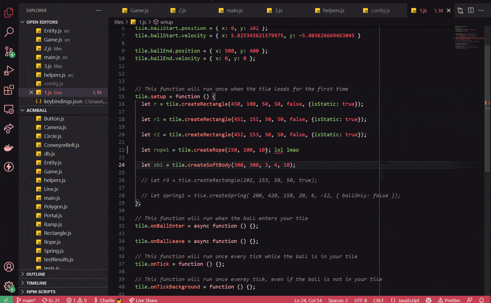

# acmBall Documentation

## Table of Contents

- [Getting Started](#Getting-Started)

# Getting Started

Recommended Text Editor:

- VSCode

Recommended Web Server:

- Live Server - VSCode Extension



### Forking the code

To create a fork of the repository, click "Fork" in the top right of the
repository on GitHub.

Once you've created a fork of the repository, use git to clone the repository to
your local machine.

If you need help cloning the repository, refer to [Cloning your
fork](./cloningYourFork.md).

You can do this by running

```bash
git clone --depth 1 <your fork url>
```

You can also clone the repository from VSCode, or GitHub Desktop.

To clone the repo

## Developing

### Types

The game provides a few primitive types. **The most important type that everyone
should read is [`Tile`](Tile.md)**. Documentation is provided for the following
types:

- [`Tile`](Tile.md) describes the play field of each group.
- [`Entity`](Entity.md) describes an object in the game.
- [`Circle`](Circle.md) is a circle [`Entity`](Entity.md).
- [`Button`](Button.md) is a rectangle that calls a function when anything
  presses or releases it.

### Helpers

The game provides a few helper functions defined in the [Helpers](helpers.md)
page. Helpers are usually imported into the file by default, so the examples
should just work.

### Bugs

Throughout development, bugs may be encountered. Before asking for help, please
check the [Bugs](Bugs.md) page to see if it's known. If you must do something
that is buggy, please ask us for help before proceeding.
