# Tile

`Tile` is the play field of each group. Each group only gets one tile, and they
mostly only develop that tile only.

A tile may have entities (see [`Entity`](Entity.md)), which are objects within
it. For example, the ground is an entity created by `createRectangle`. The
[default template tile `tiles/template.js` file](../tiles/template.js) should
have this.

## Coordinate System

Most `create` method described by `Tile` will take in the 4 (four) parameters
`x`, `y`, `width` and `height`. It is important to note that **`x` and `y`
coordinates describe the middle point** of a shape.

For example, a square with `(x, y) = (20, 20)` and `width = height = 20` means,
on the coordinate grid, a square with its 4 corners at `(10, 10)`, `(30, 10)`,
`(10, 30)`, and `(30, 30)`.

The coordinates are also relative to each tile. This means that regardless of
what or where your tile is, you will always have `0 <= x <= tile.width` and
`0 <= y <= tile.height`.

## Properties

### `ballStart: object`

`ballStart` describes the position and velocity of the ball when it enters the
tile. The game will guarantee that, as the ball enters the tile, it will
**always** be at that position with that velocity. This ensures that nothing
behaves unexpectedly as they're being developed.

All tile files will already have lines to change `ballStart` at the top.

The object has the following structure:

```ts
{
  position: {
    x: number;
    y: number;
  }
  velocity: {
    x: number;
    y: number;
  }
}
```

#### Example: Default `ballStart` values

See [tiles/template.js](../tiles/template.js).

```js
tile.ballStart.position = { x: 0, y: 0 };
tile.ballStart.velocity = { x: 0, y: 0 };
```

### `ballEnd: object`

`ballEnd` describes the position and velocity of the ball when it leaves the
tile to enter the next tile. For example, if a ball is going from tile A to tile
B, then **A's `ballEnd` MUST BE B's `ballStart`**. If this is not the case, then
the game's tests will fail.

The structure of `ballEnd` is similar to `ballStart`.

#### Example: Default `ballEnd` values

See [tiles/template.js](../tiles/template.js). These values are only to act as
filler. **The developers of a tile should always communicate with their next
tile to agree on their `ballEnd` and `ballStart`**.

```js
tile.ballEnd.position = { x: 0, y: 0 };
tile.ballEnd.velocity = { x: 0, y: 0 };
```

### `setup: function`

`setup` is a function that's called once when the game first loads, even if it's
not that tile's turn. It is commonly used to start placing down entities that
are part of the tile.

`setup` is guaranteed to be called before `onBallEnter` and `onTick` are.

The function must take in no arguments and return nothing.

#### Example: Default `setup` value

See [tiles/template.js](../tiles/template.js). The `setup` function in the
default template tile creates a rectangle that spans the entire bottom part,
which acts as the ground.

```js
tile.setup = function () {
  tile.createRectangle(tile.width / 2, tile.height - 20, tile.width, 40);
};
```

### `onBallEnter: function`

`onBallEnter` is a function that's called once when the ball enters the tile. It
can be used for various use cases, such as changing the color of something when
the ball enters.

The function must take in no arguments and return nothing. The function can
either be `async` or not. If `sleep` is used, then the function must be `async`.
See [Helpers](./helpers.md) for more information.

#### Example: Default `onBallEnter` value

See [tiles/template.js](../tiles/template.js). The `onBallEnter` function is
`async` by default. It also does nothing by default.

```js
tile.onBallEnter = async function () {};
```

### `onBallLeave: function`

`onBallLeave` is a function that's called once when the ball leaves the tile. It
can be used for various use cases, such as changing the color of something when
the ball leaves.

The function must take in no arguments and return nothing. The function can
either be `async` or not. If `sleep` is used, then the function must be `async`.
See [Helpers](./helpers.md) for more information.

#### Example: Default `onBallLeave` value

See [tiles/template.js](../tiles/template.js). The `onBallLeave` function is
`async` by default. It also does nothing by default.

```js
tile.onBallLeave = async function () {};
```

### `onTick: function`

`onTick` is a function that's called on every game tick. A game tick is every
time the game decides to process the game. The game processes itself 60 times a
second (meaning 60 ticks per second, or 60 TPS).

**`onTick` is only called as long as the ball is in the tile**. It is NOT called
if the ball is outside of the tile.

#### Example: Default `onTick` value

See [tiles/template.js](../tiles/template.js). The `onTick` function does
nothing by default.

```js
tile.onTick = function () {};
```

#### Example: Rotate a square a bit every tick.

```js
// Define a square variable to nothing on the global scope. This means that all
// functions below this line can access square.
let square;

tile.setup = function () {
  // Initialize the above square variable to a valid rectangle. setup is
  // guaranteed to be called before onTick is.
  square = tile.createRectangle(50, 50, 20, 20);
};

tile.onTick = function () {
  // Rotate by 1.5deg every tick. With 60 TPS, this means rotating 90deg a
  // second.
  square.angle += 1.5;
};
```

### `width: number`

`width` is the width of the tile. It is always 500.

### `height: number`

`height` is the height of the tile. It is always 500.

#### Example: Printing the width and height of the tile

```ts
console.log(`${tile.width} x ${tile.height}`);
// Output:
// 500 x 500
```

### `ball: Circle`

`ball` is the game's ball. It has all of [`Circle`](./Circle.md)'s method.

#### Example: Changing the ball's size and color

The ball's default values are:

- `color = "#f99"`
- `radius = 20`

```js
tile.ball.color = "green";
tile.ball.radius = 100;
```

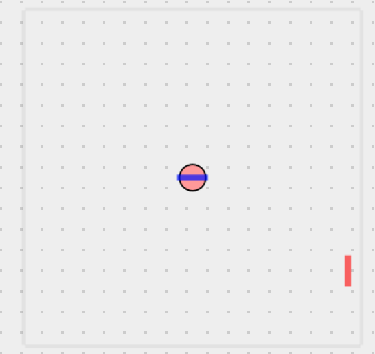 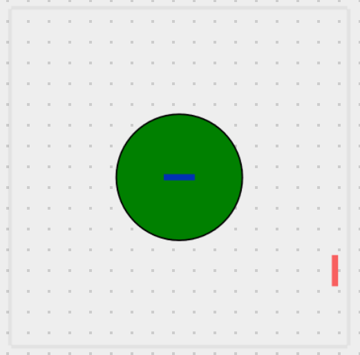

## Methods

Below are `Tile`'s different methods. To use them, use e.g.
`tile.createRectangle` in your tile.

### `createRectangle`

```ts
createRectangle(x: number, y: number, width: number, height: number, moveable = false): Entity
```

`createRectangle` creates a rectangle shape on your Tile. It is the most basic
shape that you can put on a tile.

#### Parameters

- `x`: the middle point of the rectangle to be created relative to the
  horizontal x-axis.
- `y`: the middle point of the rectangle to be created relative to the vertical
  y-axis.
- `width`: the width of the rectangle.
- `height`: the height of the rectangle.
- `moveable` (optional): whether the rectangle is affected by the gravity. The
  default is false, meaning that the created rectangle stays in place throughout
  the game.

#### Example: Making a basic rectangle at the middle of the tile with the dimensions 100x100

This example makes a new rectangle into the variable called `rect`.

```ts
let rect = tile.createRectangle(
  // Dividing the width and height by 2 gets us the point right on the middle
  // of the tile. Placement of the rectangle is done at the center of the
  // shape (see Coordinate System).
  tile.width / 2,
  tile.height / 2,
  // Width and height.
  100,
  100
);
```

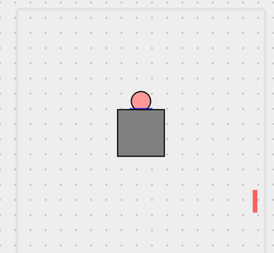

#### Example: Create a small box that drops from the top-middle

```ts
tile.createRectangle(tile.width / 2, 10, 10, 10, true);
```

### `createLine`

```ts
createLine(x1: number, y1: number, x2: number, y2: number, thickness: number, moveable = false): Entity
```

`createLine` creates a line connecting 2 points on the tile.

#### Parameters

- `x1`: the X value of the first point.
- `y1`: the Y value of the first point.
- `x2`: the X value of the second point.
- `y2`: the Y value of the second point.
- `thickness`: the thickness of the line.
- `moveable` (optional): whether the line is affected by the gravity. The
  default is false, meaning that the created line stays in place throughout the
  game.

#### Example: Make a platform spanning the bottom of the tile

```js
tile.createLine(0, 480, 500, 480, 10);
```

#### Example: Make a thin red line from the top-left corner to the bottom-right corner of the tile

```js
let diagonal = tile.createLine(0, 0, 500, 500, 8);
diagonal.color = "red";
```

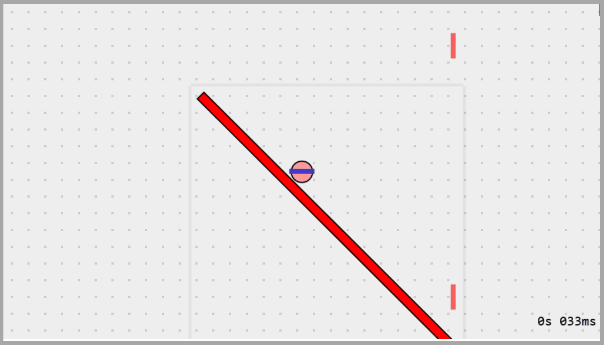

### `createTriangle`

```ts
createTriangle(x1: number, y1: number, x2: number, y2: number, x3: number, y3: number, moveable = false): Entity
```

`createTriangle` creates a triangle using 3 sets of points that are coordinates
within a tile.

#### Parameters

- `x1`: the X value of the first point.
- `y1`: the Y value of the first point.
- `x2`: the X value of the second point.
- `y2`: the Y value of the second point.
- `x3`: the X value of the third point.
- `y3`: the Y value of the third point.
- `moveable` (optional): whether the triangle is affected by the gravity. The
  default is false, meaning that the created triangle stays in place throughout
  the game.

#### Example: A tile that has the ball drop onto a triangle

```js
tile.ballStart.position = { x: 250, y: 50 };
tile.ballStart.velocity = { x: 0, y: 0 };

tile.setup = function () {
  tile.createTriangle(190, 499, 290, 499, 240, 400);
};
```

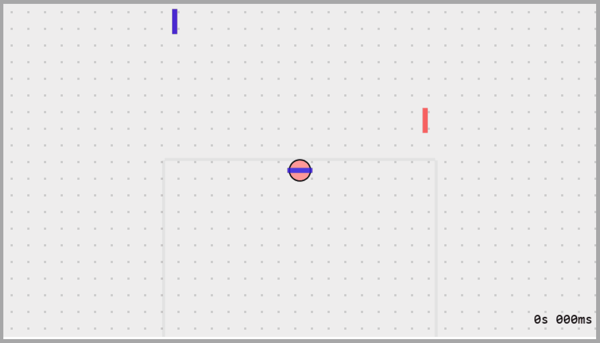

#### Example: Create a triangle with an oval in the middle

The triangle created is an isosceles triangle with 2 points at the bottom and 1
point at the top.

```js
const tri = tile.createTriangle(
  // Bottom-left point.
  100,
  400,
  // Bottom-right point.
  500,
  400,
  // Top-middle point.
  300,
  200
);
// Set the color to green (0 red, 255 green, 0 blue).
tri.color = "rgb(0, 255, 0)";

const eye = tile.createCircle(300, 325, 50);
// Set the color to a darker green.
eye.color = "rgb(0, 117, 0)";
// Scale the y-axis by 1/2 to make it an oval.
eye.scale(1, 0.5);
```

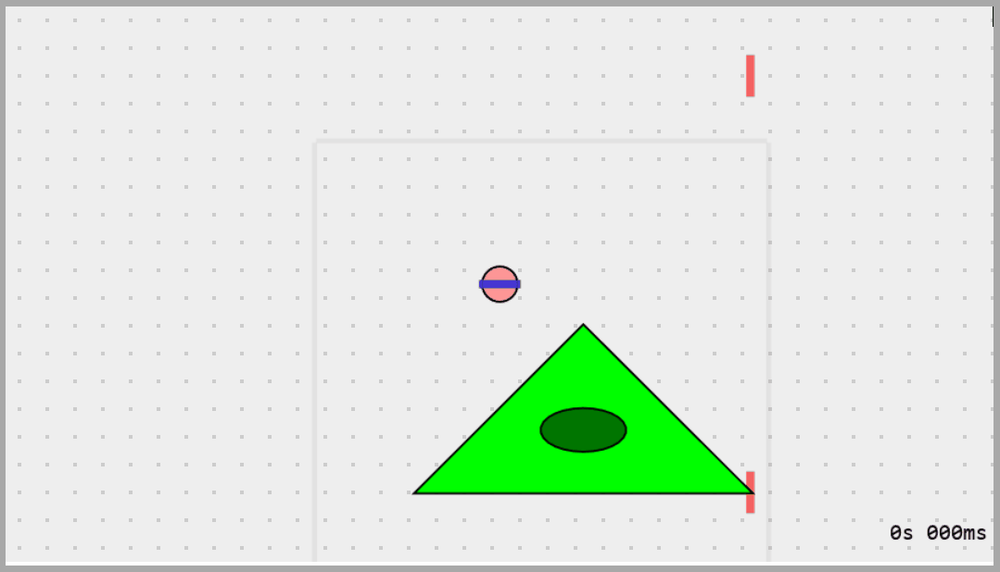

### `createRamp`

```ts
createRamp(x1: number, y1: number, x2: number, y2: number): Entity
```

`createRamp` creates a ramp, which is a right-angled triangle defined by 2
points, `(x1, y1)` and `(x2, y2)`, which define the ramp entry and exit in
either order.

#### Parameters

- `x1`: the X value of the first point (usually ramp entry).
- `y1`: the Y value of the first point (usually ramp entry).
- `x2`: the X value of the second point (usually ramp exit).
- `y2`: the Y value of the second point (usually ramp exit).

#### Example: A tile that has the ball drop onto a ramp

```js
tile.ballStart.position = { x: 250, y: 50 };
tile.ballStart.velocity = { x: 0, y: 0 };

tile.setup = function () {
  tile.createRamp(200, 399, 300, 350);
};
```


### `createCircle`

```ts
createCircle(x: number, y: number, radius: number, moveable = false): Circle
```

`createCircle` creates a circle on the tile.

#### Parameters

- `x`: the center of the circle to be created relative to the
  horizontal x-axis.
- `y`: the center of the circle to be created relative to the vertical
  y-axis.
- `radius`: the radius of the circle.
- `moveable` (optional): whether the circle is affected by the gravity. The
  default is false, meaning that the created circle stays in place throughout
  the game.

#### Example: Make a circle at the top-left corner

```ts
tile.createCircle(60, 60, 40);
```

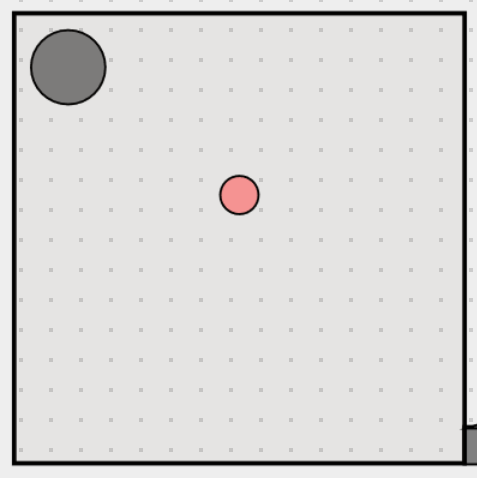

#### Example: Make a fake ball that drops from the top-middle

```ts
let fakeBall = tile.createCircle(
  // Put it at the top-middle.
  tile.width / 2,
  20,
  // The default size is 20.
  20,
  // The ball should fall.
  true
);
// Set the fake ball's color to the default ball color, which is salmon-ish.
fakeBall.color = "#f99";
```

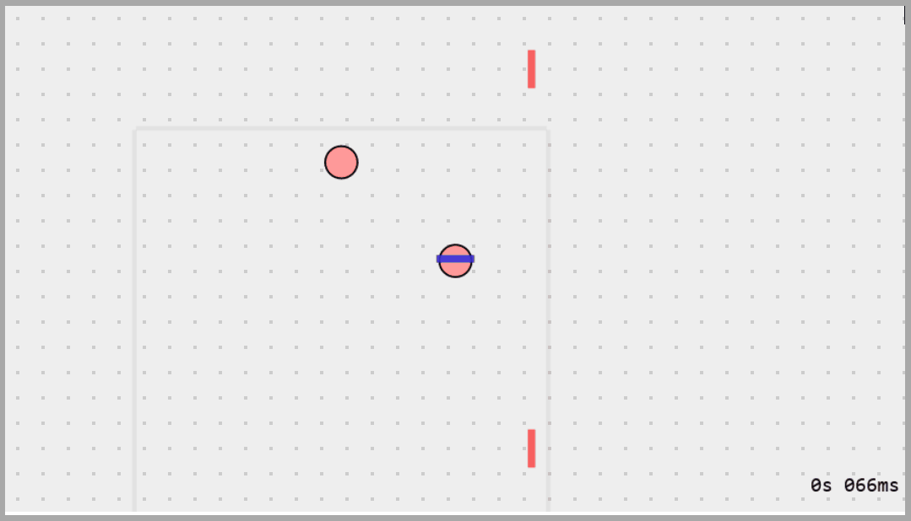

### `createConveyorBelt`

```ts
createConveyorBelt(x: number, y: number, width: number, height: number, speed: number): Entity
```

`createConveyerBelt` creates a new conveyor belt that launches the ball left or
right in the direction parallel to the belt.

#### Parameters

- `x`: the middle point of the conveyor belt to be created relative to the
  horizontal x-axis.
- `y`: the middle point of the conveyor belt to be created relative to the
  vertical y-axis.
- `width`: the width of the conveyor belt.
- `height`: the height of the conveyor belt.
- `speed`: the speed (or velocity) at which to set the ball to when it hits the
  conveyor belt. If `speed` is negative, then the ball gets launched to the left
  instead of the right.

#### Example: A tile where the ball gets tossed onto a conveyor belt

```js
tile.ballStart.position = { x: 0, y: 202 };
tile.ballStart.velocity = { x: 5.825343621579975, y: -5.403626669463045 };

tile.setup = function () {
  tile.createConveyorBelt(tile.width / 2, 485, 200, 10, true);
};
```

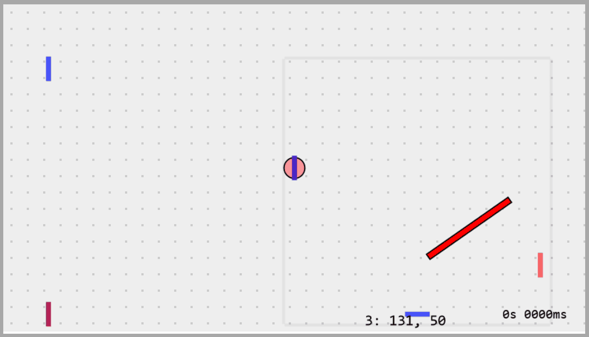

### `createPortals`

```ts
createPortals(x1: number, y1: number, x2: number, y2: number): Entity[]
```

`createPortals` creates a pair of portals. It returns an array of 2 entities,
the first one being the orange portal, and the second one being the blue portal.
When the ball touches one portal, it will be teleported to the other ball.

Note that `createPortals` **only works for the ball**.

### `createButton`

```ts
createButton(x: number, y: number, width: number, height: number, callback: function, endCallback = (_) => {}): Button
```

`createButton` creates a [`Button`](./Button.md), which is a rectangle that
calls the given function when anything (including the ball) touches it.

#### Parameters

- `x`: the middle point of the button to be created relative to the
  horizontal x-axis.
- `y`: the middle point of the button to be created relative to the vertical
  y-axis.
- `width`: the width of the button.
- `height`: the height of the button.
- `callback`: the function to be called when anything hits the button.
- `endCallback` (optional): the function to be called when the thing no longer
  hits the button.

#### Example: Change the color of a circle once the ball hits a button

This example permanently changes the color of a square from green to red once
the ball (or anything) hits the button.

```ts
let square = tile.createCircle(tile.width - 40, 40, 20);
square.color = "green"; // green by default

// Tip: to test this, change your `ballStart.position` so that the ball falls
// onto the button.
tile.createButton(tile.width / 2, 400, 200, 8, () => {
  square.color = "red";
});
```

#### Example: Change the color of a circle as long as the ball is on a button

This example, unlike the top one, changes the color back as soon as the ball
stops touching the button.

```ts
let square = tile.createCircle(tile.width - 40, 40, 20);
square.color = "green"; // green by default

// Tip: to test this, change your `ballStart.position` so that the ball falls
// onto the button.
tile.createButton(
  tile.width / 2,
  400,
  200,
  8,
  () => {
    // This function is called when the button is pressed.
    square.color = "red";
  },
  () => {
    // This function is called when the button is no longer pressed.
    square.color = "green";
  }
);
```

The code can be made slightly better by using `sleep` within an `async` function
to add a delay before the color changes back. The code below only sets the color
back after the ball has left for exactly 1 second.

```ts
tile.createButton(
  tile.width / 2,
  400,
  200,
  8,
  () => {
    square.color = "red";
  },
  // !!!
  async () => {
    await sleep(1000); // sleep for 1 second or 1000 milliseconds.
    square.color = "green";
  }
);
```

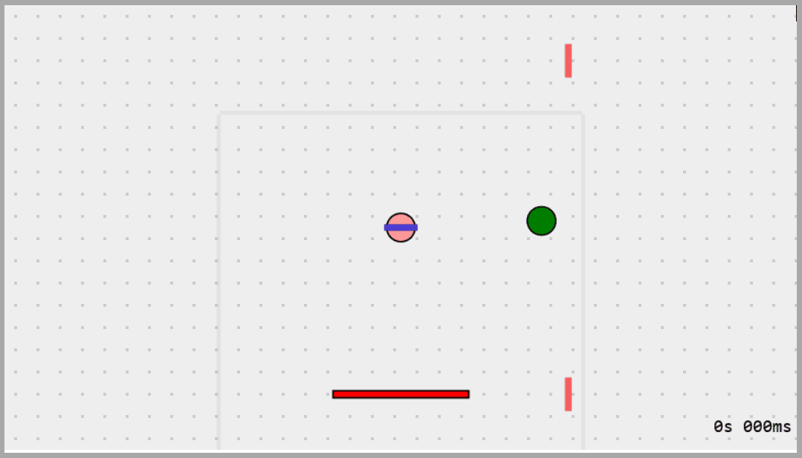

### `createSpring`

```ts
createSpring(x: number, y: number, width: number, height: number, vx: number, vy: number): Spring
```

### `createRope`

```ts
createRope(x: number, y: number, length: number): Rope
```

`createRope` creates a rope in the tile with the top of the rope (anchor)
positioned at `(x, y)`. A rope consists of beads, or small circles that dangle
underneath the anchor.

#### Parameters

- `x`: the center of the anchor circle to be created relative to the
  horizontal x-axis.
- `y`: the center of the anchor circle to be created relative to the vertical
  y-axis.
- `length`: the length of the rope **in units of beads**. `2` means 2 beads
  dangling off the anchor.

#### Example: Create a rope that dangles off the top-middle

```js
tile.createRope(tile.width / 2, 10, 18);
```

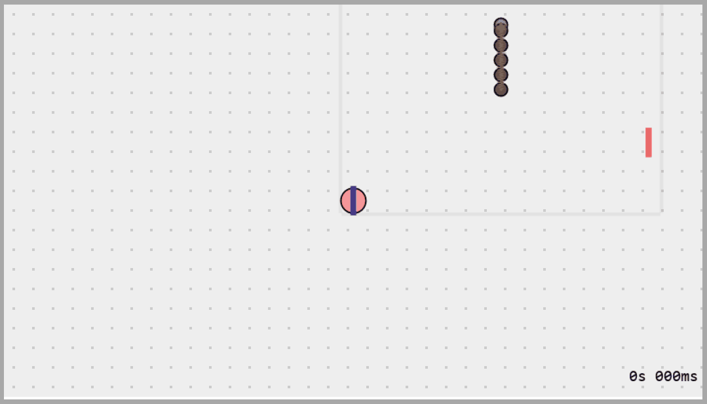
